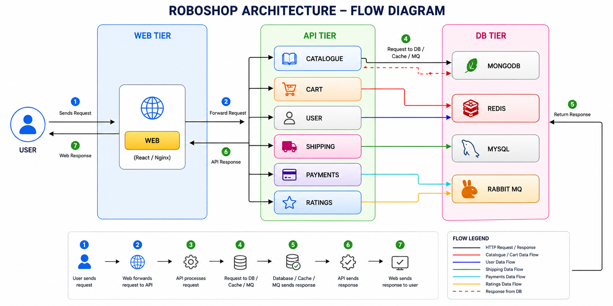
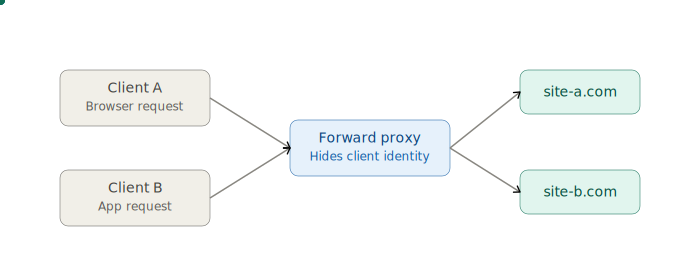
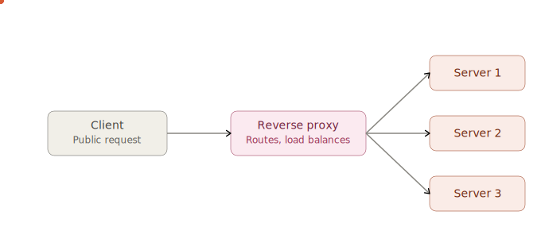

# roboshop-documentation

Below is the communication between components and dependency. This dependency comes from **Development team**. Architects decide that, DevOps has no scope in this.

### WEB TIER:
* Usually web tier is the one which has frontend technologies like HTML, CSS, Java Script (React/Angular/Node).
* We use web server to deploy these kind of applications.
* Earlier Apache Server was popular, Now Nginx is the most popular web server.

### APP TIER:
* APP/API Tier is the one which has backend technologies like Java, .NET, Python, Go, Php, etc.
* Earlier Backend technologies had servers like tomcat, Jboss, IIS, etc.
* Now all backend technologies are coming up with in built servers.
* Usually API tier should not opened through internet, it should be only accessible through web tier.

### DB TIER:
* Storage of the applications will be here like user data, products, orders data, etc.
* We can use RDBMS like MySQL, MSSQL, Postgress, etc for row and column based data.
* We can use NoSQL databases like MongoDB for storing the product information.
* We can use Cache servers like Redis to access the data with lightening speed.
* We can use MQ Servers like RabbitMQ, ActiveMQ, Kafka, etc for asynchronous communication.

### FORWARD PROXY
Forward proxy sits in front of clients. Each client sends its request to the proxy, and the proxy forwards it out to whichever external server the client wants to reach. From the server's point of view, all it sees is the proxy — it has no idea which actual client made the request. This is why forward proxies are used for things like bypassing content filters, anonymizing traffic, or enforcing company-wide internet policies.
Now compare that to a reverse proxy, which sits in front of servers instead of clients.

### REVERSE PROXY
Reverse proxy does the opposite job. The client only ever talks to the proxy — it has no idea how many backend servers exist or which one actually handled its request. The proxy decides where to route each incoming request, often spreading them across servers 1, 2, and 3 in turn (load balancing), which is what the animation cycles through.

The core difference to remember:

Forward proxy — protects/represents the client, hiding it from the servers it talks to.
Reverse proxy — protects/represents the server(s), hiding them from the clients that talk to it.

Common real-world examples: a forward proxy is what a corporate VPN or a service like a VPN app does for outbound browsing; a reverse proxy is what tools like Nginx, HAProxy, or Cloudflare do in front of a website's backend.